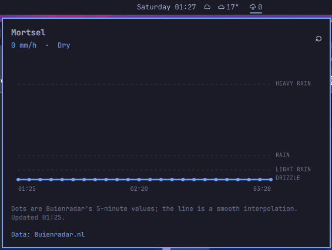

# Rain Radar Belgium & Netherlands

An Omarchy Shell bar widget backed by Buienradar. Click the bar value to see
the expected rainfall in mm/h for the current position, with five-minute
forecast samples joined by a smooth curve with a shaded area down to zero.
The fixed nonlinear vertical scale gives drizzle and light rain more space
and compresses heavy showers. Numeric guides show actual mm/h; a dry
forecast lies on the zero baseline with no filled area. The curve preserves
the shape of the samples without overshooting peaks or dipping below zero.

## Location

Click **Change location** in the popup (or press **C**) to open the Belgium and Netherlands map. Click a city name to select its center, or click anywhere on the map for coordinates directly. The orange ring marks the selection; **Use selected location** saves it and loads its forecast. **Cancel** leaves the forecast unchanged. You can also Tab to the map and use arrow keys to adjust the coordinates.

The blue dot shows the automatic location, separately from the selected forecast position. Its label identifies whether it comes from Weather settings or approximate IP geolocation; it is not a GPS fix. If automatic lookup fails or falls outside the map, you can still choose a position manually. **Use automatic location** restores automatic positioning.

Before a choice is saved in the picker, the widget uses, in order:

1. latitude and longitude entered in the widget settings;
2. the location configured for Omarchy's Weather widget;
3. an approximate IP-based current location, tried across several providers
   (GeoJS, `ipwho.is`, then `ipapi.co`) to survive rate limits or outages.

Picker choices persist across shell restarts in `$XDG_STATE_HOME/omarchy/settings/rain-radar-location.json` (normally `~/.local/state/omarchy/settings/rain-radar-location.json`) and are shared between monitors. Changing the latitude, longitude, or location name in widget settings supersedes the saved picker choice. Choosing automatic location uses Weather settings, then IP lookup.

The map works offline using bundled [Natural Earth outlines](MAP-SOURCES.md). It is a location picker, not a live rain overlay. City labels cover a selection of major cities; any other town can be chosen by clicking its position. No map tile or geocoding service receives map clicks. The existing rectangular coverage check is approximate; a point near a border or offshore is not a guarantee of forecast availability.

The Buienradar forecast only covers Belgium and the Netherlands. Coordinates
are sent to `gps.buienradar.nl`. Middle-click the widget or press Enter in the
popup to refresh.

## Development checks

Run `node --test tests/*.test.cjs`, `qmllint LocationMap.qml`, and `omarchy plugin validate .`. The map's mouse and keyboard tests run with `QT_QPA_PLATFORM=offscreen QT_QUICK_BACKEND=software qmltestrunner -input tests`. Depending on the distribution, the Qt tools may be under `/usr/lib/qt6/bin/`.

In an Omarchy desktop session, `bash tests/check-panel.sh` tests selection persistence, rapid city changes, automatic reset, coordinate settings edits, and the full popup using simulated forecasts and temporary state. It briefly opens a separate preview without modifying the installed plugin. Optionally set `RAIN_RADAR_TEST_CAPTURE=/tmp/rain-radar-picker.png` to save the rendered picker.
